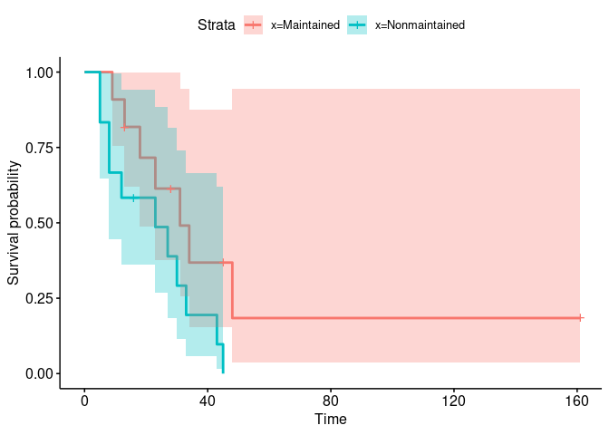
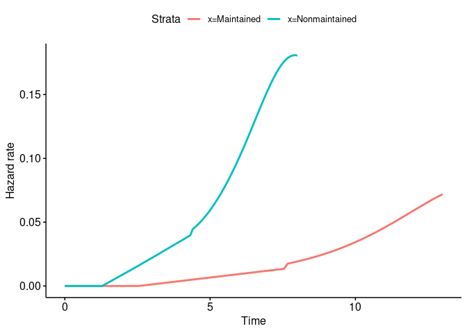
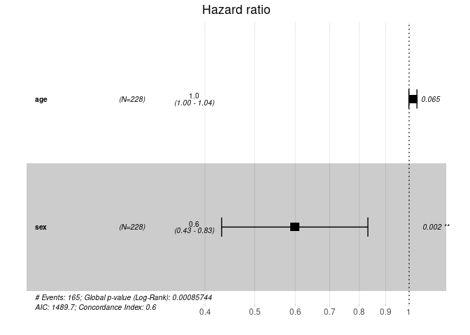
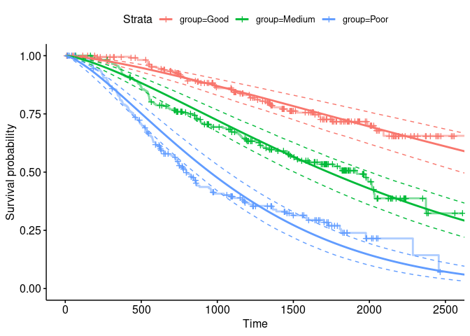

<!-- README.md is generated from README.Rmd. Please edit that file -->

# vsd

<!-- badges: start -->
<!-- badges: end -->

`vsd` is a shim package that allows for appealing and relevant graphical
output for Survival Analysis data sets.

## Installation

You can install the released version of vsd from
[CRAN](https://CRAN.R-project.org) with:

``` r
install.packages("vsd")
```

And the development version from [GitHub](https://github.com/) with:

``` r
# install.packages("devtools")
devtools::install_github("cyanzule/vsd")
```

## Example

``` r
library(vsd)
#> Loading required package: survival
#> Loading required package: ggplot2
vsd(survfit(Surv(time, status) ~ x, data = aml), .include = c("fit", "haz"), conf.int = T)
#> $fit
```



    #> 
    #> $hazard



``` r
vsd(coxph(Surv(time, status) ~ age + sex, data = lung), .include = c("forest", "res"))
#> $forest
```



    #> 
    #> $residuals


``` r
library(flexsurv)
vsd(flexsurvreg(Surv(rectime, censrec) ~ group, data = bc, dist = "weibull"))$param
```


